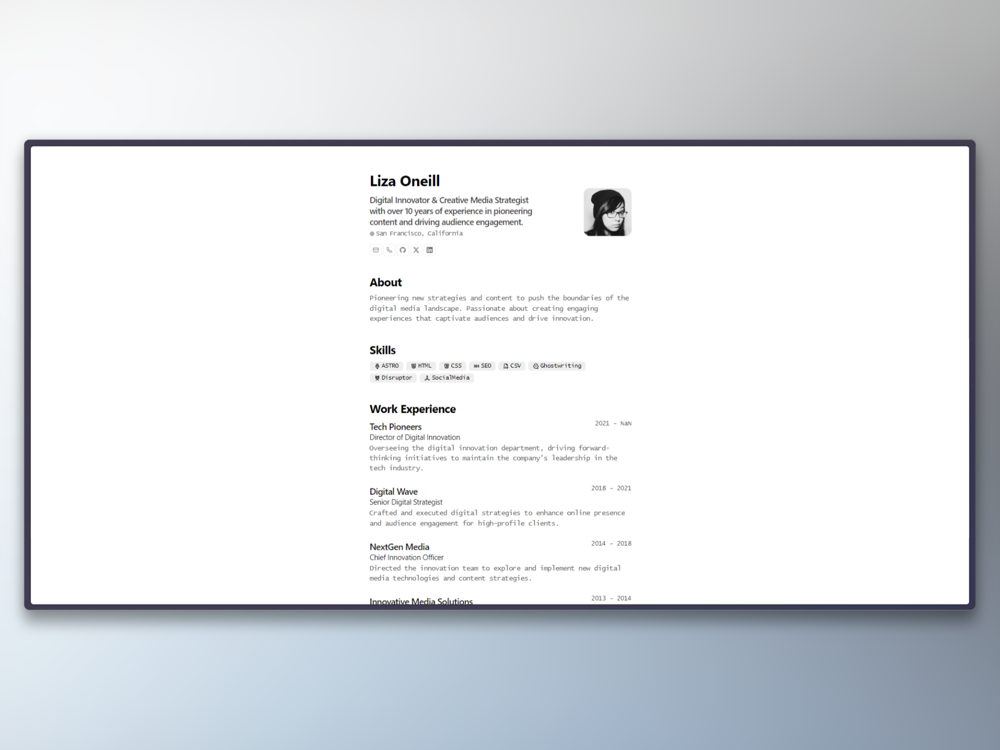

<div align="center">
 

<h2>Minimalist <em>Portfolio</em>  ready for web and pdf</h2>

<p>JSON Schema for CV of <a href="https://jsonresume.org/schema/">jsonresume.org</a></p>

<p>Based on the design of <a href="https://github.com/BartoszJarocki/cv">Bartosz Jarocki</a></p>

<p>Embracing the comprehensive instructions and guidance of <a href="https://github.com/midudev/minimalist-portfolio-json">Midudev</a> and his <a href="https://www.youtube.com/watch?v=Zwh92LTB-Bk&t=474s">tutorial</a></p>

</div>

<div align="center">
    <a href="#🚀-Start">
        Start
    </a>
    <span>&nbsp;✦&nbsp;</span>
    <a href="#🧞-Commands">
        Commands
    </a>
    <span>&nbsp;✦&nbsp;</span>
    <a href="#🔑-Licence">
        Licence
    </a>
   
</div>

<p></p>

<div align="center">


</div>

</img>

## 🛠️ Stack

- [**Astro**](https://astro.build/) - The web framework for content-driven websites.
- [**Typescript**](https://www.typescriptlang.org/) - TypeScript is JavaScript with syntax for types.
- [**Ninja Keys**](https://github.com/ssleptsov/ninja-keys) - Keyboard shortcut interface for your website.

## 🚀 Start

### 1. Usa este [repo](https://github.com/stevenzepol/astro-minimalist-portfolio) como _template_ de un proyecto de Astro


- I use [pnpm](https://pnpm.io/installation) as package manager.

```bash
# Active pnpm in MacOS, WSL & Linux:
corepack enable
corepack prepare pnpm@latest --activate

# Initialite the project
pnpm create astro@latest -- --template stevenzepol/astro-minimalist-portfolio
```

### 2. Add your content:
Edit the `cv.json` file to create your own printable Portafolio/CV.
### 3.  Launch dev server:

```bash
# Enjoy the results
pnpm dev
```


1. Open [**http://localhost:4321**](http://localhost:4321/) in your browser to see the portfolio 🚀


## 🧞 Commands

|     | Comando          | Acción                                        |
| :-- | :--------------- | :-------------------------------------------- |
| ⚙️  | `dev` o `start` | Lanza un servidor de desarrollo local en  `localhost:4321`.  |
| ⚙️  | `build`          | Comprueba posibles errores y hace un empaquetado de producción en `./dist/`.      |
| ⚙️  | `preview`        | Vista previa en local `localhost:4321` |


## 🔑 Licence

[MIT](LICENSE.txt) - Creado por [**midudev**](https://midu.dev).

## 🧞 Commands

All commands are run from the root of the project, from a terminal:

|   | Command                   | Action                                           |
|:--| :------------------------ | :----------------------------------------------- |
|⚙️ | `pnpm install`             | Installs dependencies                            |
|⚙️ | `pnpm dev`             | Starts local dev server at `localhost:4321`      |
|⚙️ | `pnpm build`           | Build your production site to `./dist/`          |
|⚙️ | `pnpm preview`         | Preview your build locally, before deploying     |


## 👀 Want to learn more?

Feel free to check [our documentation](https://docs.astro.build) or jump into our [Discord server](https://astro.build/chat).
